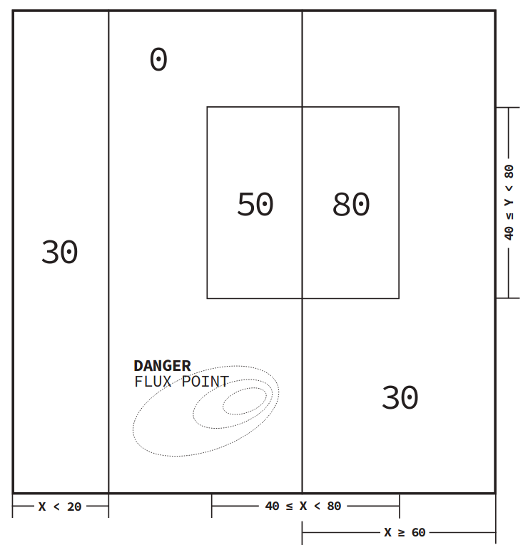

## range-match

Range match, is a partial implementation of pattern matching. Focused on cleanly allowing complex "stuctured" programming. The main detail is that its requires the logic to be written using ranges such as `1<=x<=3`. Replacing particularly nasty if-else chains. 

## Example

Suppose you have the following state space:



This can be impliented as:

```d
int fluxstate(vec2 postion){
  import rangematch;
  mixin rangematchsetup!(vec2,int);
  return postion |
    pattern(40<<x<<59,40<<y<<79,50)|
    pattern(59<<x<<79,40<<y<<79,80)|
    pattern(20<<x<<59,    y    , 0)|
    pattern(    x    ,    y    ,30);
}
```

## notes

* rangematchsetup takes an input and output type to define several aliases and pattern
* Postion is a vec2, the "input" type given to rangematch setup. 
* x and y are aliases to rangeof!ints(can be different) 
* left<<, *and* right<< are op overloads that mean "I'm greater/lesser then or equal" to so 40<=postion.x && postion.x<=59
* patterns take rangeof! sub members of the input type, *in the order they are defined by the struct* and an output
* pattern | takes an input from the left, if it "matches" it passes its output, otherwise it trys to pass its it to the next pattern, if it fails it throws an runtime assert.
* you can leave a untouch rangof, define one hand or simply set it equal(using =)
* see poker.d for a more complex example.

